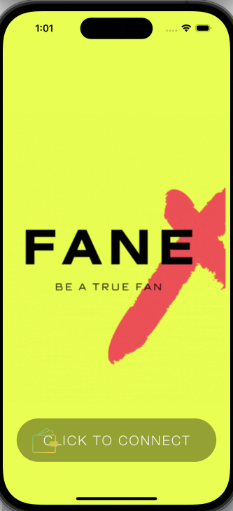
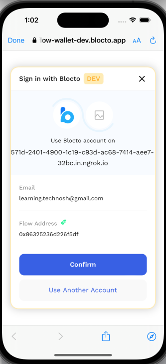

# FanEx - ICC Loyalty Program

FanEx is a loyalty program developed for ICC fans to enhance their experience while enjoying the game. The program uses tokens and NFTs to reward fans for their engagement and loyalty towards the sport.

## Overview

FanEx provides a platform for fans to earn tokens through various methods, such as attending live matches, interacting with players on social media, and participating in quizzes and contests. These tokens can be redeemed for exclusive merchandise and rewards, including limited edition NFTs.

The program utilizes blockchain technology to ensure transparency and security in transactions. Smart contracts are used to store and manage the token and NFT transactions, providing a tamper-proof and efficient system for the exchange of rewards.

The program also incorporates auctions for selling merchandise using tokens, allowing fans to bid on exclusive items and memorabilia.

## Technologies Used

* Python (flask) for backend
* Mongodb for database
* Flow Blockchain
* Smart contract using cadence language
* Swift for mobile application

## Features

* Earn tokens through live match attendance, social media interaction, and contests
* Redeem tokens for exclusive merchandise and rewards, including limited edition NFTs
* Auctions for selling merchandise using tokens
* Tamper-proof and secure system utilizing blockchain technology
* User-friendly interface for seamless engagement

## Codebase

1. Smart Contract
    Smart contract is written using cadence language on flow blockchain.
    The codebase for the smart contract resides in the [smart contract](SmartContract/) subdirectory
    In this we have created two smart contracts
    1. FanEx Token: This is to store the tokens which are credited for engagement
    2. FanEx NFT: This will store the exclusive NFTs which are owned by fans

    There are multiple transactions and scripts which are created to interact with the smart contract. These include features like deposit in wallet, withdraw from wallet, get balance, mint nft, deposit nft into an account, etc.
2. Backend
    The backend is written using python programming language and flask framework
    The code base for the backend resides in the [backend directory](Backend/)
    In the backend we have created REST apis for multiple features, like admin api to validate and send rewards, api to set reward point for twitter interactions, api to set reward points for tickets, etc.

3. Front end
    For the front end we have developed a nativ mobile application for IOS using swift programing language.
    The codebase for the application resides in [mobile application directory](MobileApp/)
    In the application we have created interface to login using wallet, scanning ticket's QR code to get rewards, option to like tweets in ICC's feed and get rewarded for it, etc.

## Video
[Video explaining the demo]()

## Conclusion

FanEx is an innovative and engaging loyalty program that rewards ICC fans for their loyalty and engagement. With its use of blockchain technology and seamless user experience, it provides a unique and secure platform for fans to enhance their experience of the sport.

## Team Information

Team: One and half nibble

Track: Blockchain & Web 3

## Screenshots

